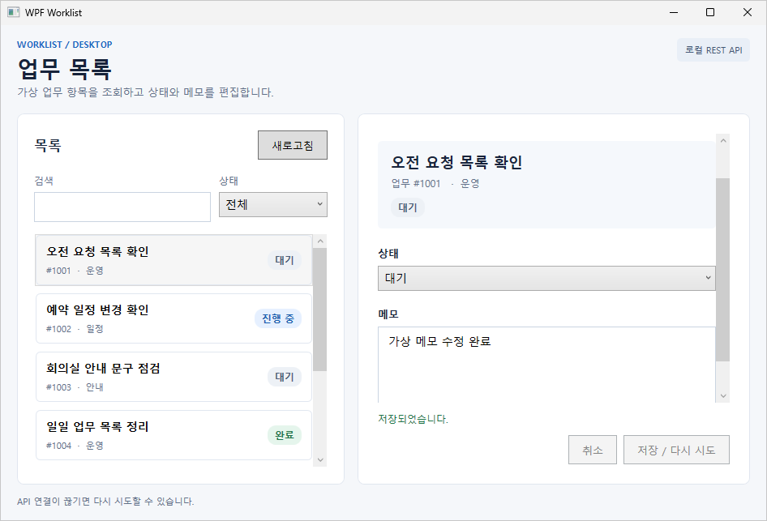
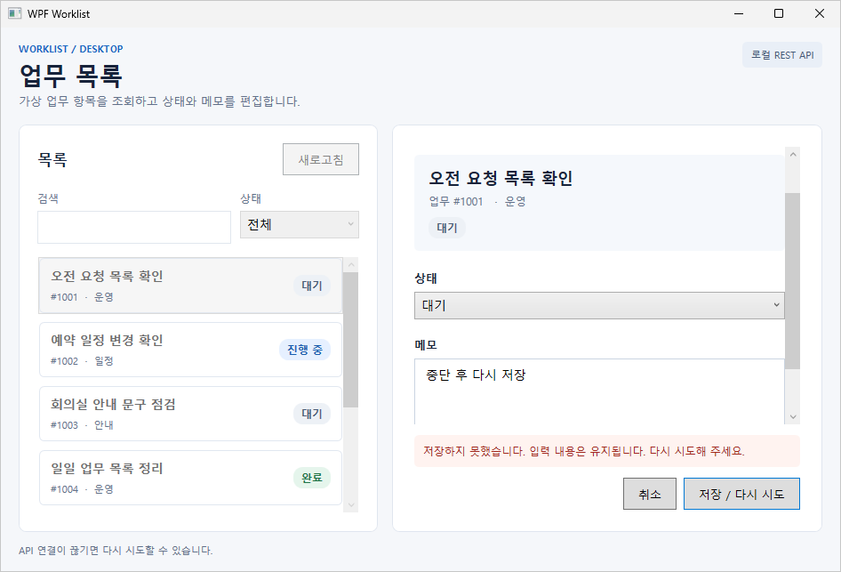

# wpf-demo

WPF 데스크톱 업무 목록과 로컬 HTTP API를 연결한 예제입니다. 목록을 검색하고 상태로 거른 뒤, 항목의 상태와 메모를 수정해 저장하거나 취소할 수 있습니다.

## Windows 화면



API 연결이 끊기면 입력 내용을 유지한 채 저장 실패를 표시합니다.



## 구성

- `src/WpfDemo.Client`: .NET Framework 4.8 WPF 앱. XAML 바인딩과 ViewModel이 검색, 선택, 입력 검증, 저장 상태를 처리합니다.
- `src/Shared`: 클라이언트와 테스트가 함께 사용하는 모델과 ViewModel.
- `src/WpfDemo.Api`: .NET 10 Minimal API. 메모리에 업무 항목 5개를 두고 `GET /api/work-items`, `PUT /api/work-items/{id}`를 제공합니다. 서버를 다시 시작하면 초기 데이터로 돌아갑니다.
- `StatusBadge`: dependency property와 `ControlTemplate`을 사용하는 WPF Custom Control. 목록과 상세 화면에서 같은 컨트롤을 씁니다.
- `tests/WpfDemo.Tests`: 검색, 선택, 입력 검증, 저장, 오류와 재시도를 검사합니다.

## Windows에서 실행

빌드하려면 Visual Studio의 **.NET 데스크톱 개발** 워크로드와 .NET Framework 4.8 타기팅 팩, .NET 10 SDK가 필요합니다.

1. `wpf-demo.sln`을 Visual Studio에서 엽니다.
2. 다음 명령으로 API를 실행합니다. API는 `http://127.0.0.1:5187`에서 요청을 받습니다.

   ```powershell
   dotnet run --project src/WpfDemo.Api/WpfDemo.Api.csproj
   ```

3. Visual Studio에서 `WpfDemo.Client`를 시작 프로젝트로 실행합니다.

Visual Studio 없이 실행하려면 GitHub Actions의 `wpf-demo-windows` 산출물을 내려받습니다. `api/WpfDemo.Api.exe`를 먼저 실행하고 `client/WpfDemo.exe`를 실행합니다. API는 Windows x64 자체 포함 배포본이며, WPF 앱에는 .NET Framework 4.8 이상이 필요합니다.

## 테스트와 Windows 확인

ViewModel 테스트는 .NET 10 SDK가 있는 macOS에서도 실행할 수 있습니다.

```sh
dotnet run --project tests/WpfDemo.Tests/WpfDemo.Tests.csproj
```

WPF 화면은 Windows에서 실행해야 합니다. GitHub Actions는 Windows에서 WPF 빌드와 API 연동 흐름을 확인하고 화면 캡처와 실행 파일을 `wpf-demo-windows` 산출물로 저장합니다.
