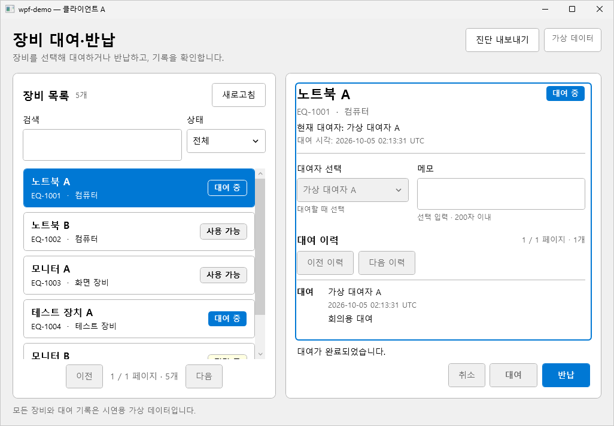
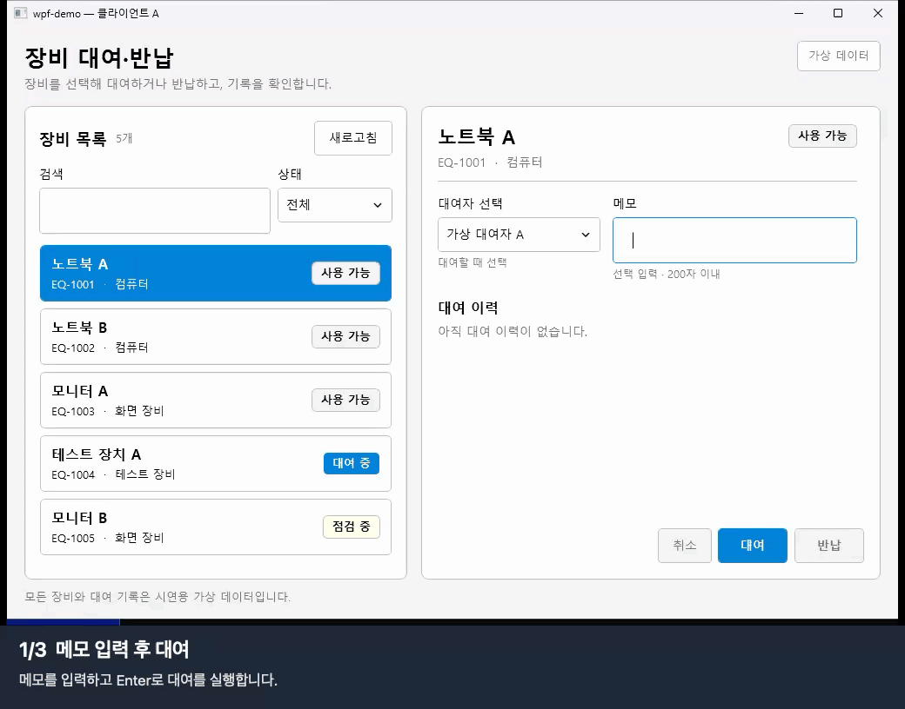

# wpf-demo

장비를 검색해 대여·반납하고 이력을 확인하는 Windows 앱입니다. WPF 클라이언트는 로컬 .NET 10 API와 통신합니다. 데이터는 모두 가상입니다.



## 시연

Windows에서 실제 앱을 녹화했습니다. 아래 GIF는 대여·반납 영상의 일부입니다.



[대여·반납 MP4](docs/videos/basic.mp4) · [응답 유실과 재시도 MP4](docs/videos/lost-response-retry.mp4)

## Windows에서 실행

[확인한 Windows Actions 실행](https://github.com/GyutaeLee/wpf-demo/actions/runs/37253113506)에서 `wpf-demo-windows` 산출물을 받습니다. 압축을 풀고 안의 `wpf-demo-windows-demo.zip`도 풉니다.

1. `api\WpfDemo.Api.exe`를 실행합니다.
2. 다른 터미널에서 `client\WpfDemo.exe`를 실행합니다.

WPF 앱에는 .NET Framework 4.8 이상이 필요합니다. 자동 시나리오와 Mac에서 화면을 확인하는 순서는 [테스트 안내](docs/testing.md)를 참고하세요.

## 구현

화면은 XAML 바인딩과 직접 작성한 MVVM으로 만들었습니다. `StatusBadge`는 목록과 상세에서 함께 쓰는 WPF Custom Control입니다. API는 SQLite에 장비와 대여 이력을 저장합니다. 결과가 확정되지 않은 요청은 클라이언트에 보관해 같은 작업 키로 다시 보냅니다. 목록과 이력은 페이지 단위로 조회하며, 연결이 끊기면 저장된 조회 결과를 표시합니다.

```sh
dotnet test tests/WpfDemo.Tests/WpfDemo.Tests.csproj -c Release
```

Windows x64에서 자동 테스트 53개와 대여·반납, 충돌, 응답 유실, 연결 실패, 앱 재시작 복구, 대량 목록 시연을 확인했습니다. [검증 범위와 영상 안내](docs/testing.md), [설계와 시나리오](docs/scenarios.md)를 따로 정리했습니다.
