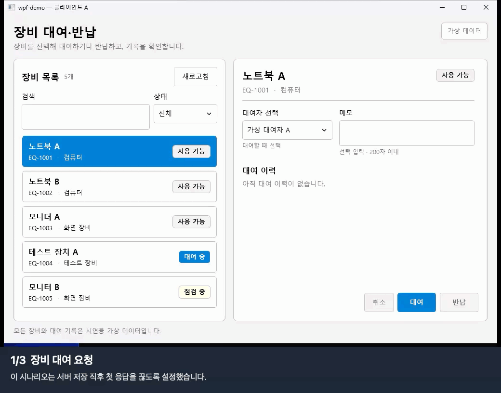

# 실행과 확인

## Windows에서 실행

1. [확인한 Windows Actions 실행](https://github.com/GyutaeLee/wpf-demo/actions/runs/36360298350)을 엽니다.
2. `wpf-demo-windows` 산출물을 내려받아 압축을 풉니다.
3. 안에 있는 `wpf-demo-windows-demo.zip`도 풉니다.
4. 첫 PowerShell 창에서 API를 실행합니다.
5. 두 번째 PowerShell 창에서 WPF 앱을 실행합니다.

```powershell
.\api\WpfDemo.Api.exe
```

```powershell
.\client\WpfDemo.exe
```

API는 `http://127.0.0.1:5187`에서 요청을 받습니다. API는 Windows x64 자체 포함 배포본입니다. WPF 앱을 실행하려면 .NET Framework 4.8 이상이 필요합니다. 실행 파일 사용에는 Visual Studio가 필요하지 않습니다.

## Mac에서 화면 확인

Mac에서 Actions 실행을 시작하면 GitHub의 Windows 환경이 API와 WPF 앱을 실행합니다. 현재 구성에서는 실행이 끝난 뒤 캡처와 영상을 내려받아 볼 수 있습니다. Windows 화면을 실시간으로 원격 조작하는 기능은 없습니다.

1. [Windows workflow](https://github.com/GyutaeLee/wpf-demo/actions/workflows/windows.yml)를 엽니다.
2. `Run workflow`에서 `main`을 선택하고 실행합니다.
3. 완료된 실행에서 `wpf-demo-windows` 산출물을 받아 압축을 풉니다.
4. `runs` 아래 시나리오별 `screenshots`의 PNG와 `videos`의 MP4를 엽니다.

이미 통과한 [실행 결과](https://github.com/GyutaeLee/wpf-demo/actions/runs/36360298350)는 다시 실행하지 않고 내려받아도 됩니다. 새 실행을 시작하려면 저장소 쓰기 권한이 필요합니다. [GitHub의 수동 실행 안내](https://docs.github.com/en/actions/how-tos/manage-workflow-runs/manually-run-a-workflow)를 참고하세요.

## 자동 시나리오

자동 시연을 실행하려면 PowerShell 7과 WinAppCLI 0.7.0을 설치합니다. 압축을 푼 패키지의 최상위 폴더에서 다음 명령을 실행합니다.

```powershell
pwsh -ExecutionPolicy Bypass -File .\scripts\Start-Demo.ps1 -Scenario Basic
pwsh -ExecutionPolicy Bypass -File .\scripts\Start-Demo.ps1 -Scenario All
```

`Basic`은 대여와 반납을 실행합니다. `All`은 정상 처리, 두 클라이언트의 대여 충돌, 저장 응답 유실, API 연결 실패, 앱 재시작 후 요청 복구를 차례로 시연합니다. 각 실행은 별도 서버·클라이언트 데이터 폴더와 결과 파일, 화면 캡처, 녹화 영상을 만듭니다. 기존 기본 데이터 폴더는 초기화하지 않습니다.

## 테스트와 확인 범위

저장소 루트에서 자동 테스트를 실행합니다.

```sh
dotnet test tests/WpfDemo.Tests/WpfDemo.Tests.csproj -c Release
```

ViewModel 테스트는 검색·필터, 입력 검증, 처리 중 잠금, 오류와 재시도, 재시작 복구를 확인합니다. API 통합 테스트는 HTTP 요청을 보내 동시 대여, 중복 요청, 저장 롤백, 데이터 유지와 잘못된 입력을 검사합니다.

macOS에서 실행한 테스트는 .NET 10 테스트 프로젝트를 대상으로 합니다. 이 결과만으로 .NET Framework 4.8 WPF 빌드나 실제 Windows 화면까지 확인한 것은 아닙니다.

| 확인 항목 | 상태 |
| --- | --- |
| macOS .NET 테스트 | 2026-09-28, MSTest 32개 통과 |
| Windows x64 빌드·테스트·시연 | [Actions 실행](https://github.com/GyutaeLee/wpf-demo/actions/runs/36360298350), MSTest 32개와 다섯 시나리오 통과 |
| 키보드와 창 크기 | Tab·Enter·Esc, 키보드로 상태 필터 변경, 작은 창과 최대화의 UI 요소 좌표를 자동 검사 |
| 100%·150% 배율, Narrator, 고대비 | Windows에서 직접 확인 전 |

연결된 기존 Actions 실행에는 WPF 빌드와 다섯 시나리오 실행이 들어 있습니다. 통과한 실행의 산출물에는 그 실행에서 만든 캡처·영상과 실행 파일이 함께 올라갑니다. 작은 창 검사는 모든 문구와 실제 디스플레이 배율에서의 가독성까지 확인하지 않습니다.

## 화면과 영상

같은 Actions 산출물의 `runs` 폴더에는 시나리오별 `result.json`, `screenshots`, `videos`가 있습니다. `result.json`에 장비 상태·대여 이력 건수·작업 키를 기록했습니다. 영상 여섯 개는 H.264 MP4이며 30~60초 길이입니다. 길이와 시작·중간·끝 프레임, 화면 상태 전환을 확인했습니다.

`Basic`은 대여·반납, `ConcurrentLoan`은 오래된 조회 결과의 충돌, `LostResponse`와 `ApiDown`은 같은 요청으로 재시도하는 흐름입니다. `RestartRecovery` 영상 두 개는 종료 전과 복구 후 화면이며, 같은 작업 키와 이력 한 건으로 연결됩니다. `LargeList`는 대량 목록의 첫째·둘째 페이지와 긴 이력을 화면에서 확인합니다.

대표 영상은 같은 실행의 녹화에서 동작 구간을 추렸습니다. [대여·반납 MP4](videos/basic.mp4)는 8.75초, [응답 유실과 재시도 MP4](videos/lost-response-retry.mp4)는 8초입니다. 긴 대기와 창 크기 검사 구간을 덜어내고, 원래 앱 화면 아래에 단계별 설명을 붙였습니다. 앱 화면의 상태나 재생 속도는 바꾸지 않았습니다. 편집 전 30초·60초 원본은 Actions 산출물에 있습니다.

README와 아래 GIF는 이 짧은 영상에서 만들었습니다. GitHub에서 MP4가 재생되지 않으면 파일을 내려받아 엽니다.



이 실행의 응답 유실 시나리오에서는 같은 작업 키로 두 번 전송했고, 재시도 전후 대여 이력은 한 건으로 유지됐습니다. 모든 시나리오의 원본 영상과 결과 파일은 Actions 산출물에서 확인할 수 있습니다.

## 확장 변경분의 현재 확인 상태

macOS에서 `dotnet test tests/WpfDemo.Tests/WpfDemo.Tests.csproj -c Release --no-restore`를 실행해 MSTest 53개가 통과했습니다. 여기에는 API 페이지 처리, 대규모 데이터 생성, 오프라인 캐시, 요청 재시도와 진단 ZIP의 개인정보 제외 검사가 포함됩니다. 대량 데이터의 대여 중 장비 반납, 데이터셋 교체 후 이전 이력의 캐시 저장 거부, 작성이 끝난 ZIP만 노출되는지도 확인합니다. 캐시 사용을 마친 뒤 DB 파일을 독점으로 다시 열 수 있는지도 검사합니다.

2026-10-02의 [첫 Windows 실행](https://github.com/GyutaeLee/wpf-demo/actions/runs/36968146670)은 테스트 46개가 통과하고 6개가 실패했습니다. 실패는 모두 테스트 종료 시 캐시 DB 파일을 삭제하는 과정에서 발생했습니다. 캐시의 연결 풀 사용을 끄고 파일 핸들 해제를 검사하는 테스트를 추가했습니다. [연결 풀은 기본으로 활성화됩니다](https://learn.microsoft.com/en-us/dotnet/standard/data/sqlite/connection-strings#pooling). 이 수정은 위 macOS 테스트에서 확인했으며 Windows 재검증은 남아 있습니다.

첫 실행은 테스트 단계에서 멈춰 WPF 빌드와 화면 시연, 조회 측정을 실행하지 못했습니다. `.github/workflows/windows.yml`은 .NET Framework WPF 빌드, 여섯 UI 시나리오, 기본 시나리오의 진단 ZIP, 그리고 장비 10,000개·이력 20,000개에서의 조회 측정을 실행하도록 구성했습니다. 측정 결과는 `artifacts/performance/large-profile.json`에 기록하며 이전 구현보다 빨라졌다는 근거로 사용하지 않습니다.

`All`은 기본 대여·반납, 두 클라이언트 충돌, 응답 유실, API 중단, 재시작 복구, 대량 목록 등 여섯 흐름을 실행합니다. `Basic` 자동 시연은 진단 ZIP을 클라이언트 데이터 폴더 아래 별도 경로에 저장합니다. 직접 실행할 때 앱은 기본적으로 Windows 문서 폴더에 내보내며, `WPFDEMO_DIAGNOSTICS_OUTPUT_DIR` 환경 변수로 경로를 지정할 수 있습니다. ZIP에는 네 개의 JSON 파일이 있고, 자동 검사는 항목 이름과 시연 메모·출력 경로 제외를 확인합니다.
